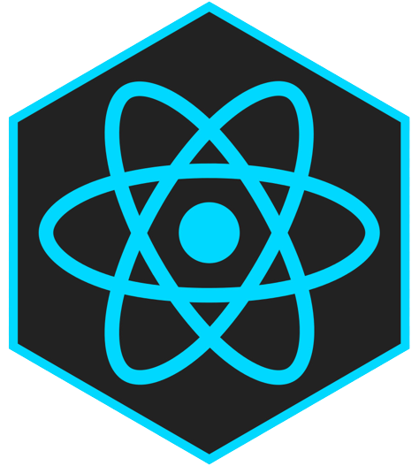
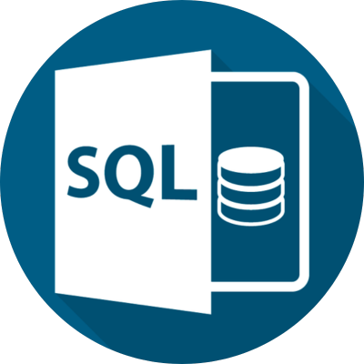
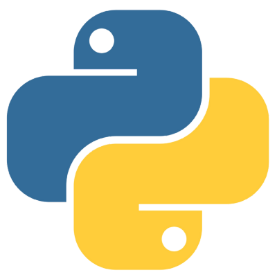
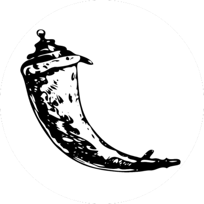

# 👋 Hello World! I'm Valentina Franciosi

### I'm an enthusiastic programmer diving into the world of coding, currently working on my final project for a full stack development bootcamp with [4Geeks](https://4geeks.com/). 🚀 I'm excited about building dynamic web applications and learning new technologies along the way.

🌐 Full Stack Developer.
- HTML
- CSS
- JavaScript
- React
- SQL/NoSQL
- Python
- Flask

📚 Currently learning through hands-on projects and collaborating with fellow developers.

💡 Always curious, I embrace challenges and believe in continuous learning. Follow along as I embark on this exciting programming journey!

📫 Let's connect: [LinkedIn](https://www.linkedin.com/in/valentinabfb/)
